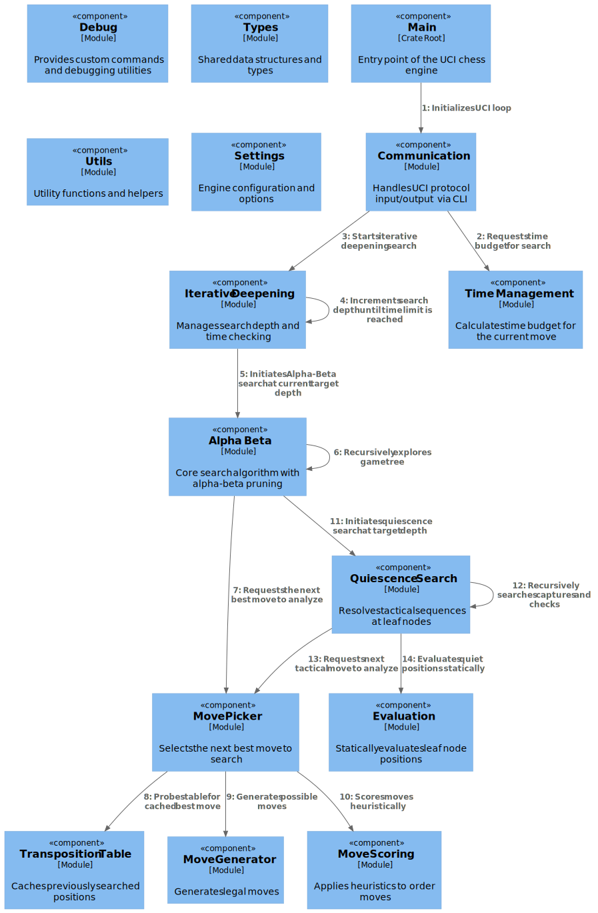

<p align="center">
  
</p>

# thunfisch [](https://github.com/Kaynoux/thunfisch/actions/workflows/thunfisch.yml)
Thunfisch is a UCI-compatible chess engine written from scratch in Rust. It uses magic‐bitboard move generation, iterative deepening with alpha-beta and quiescence search and a transposition table. For evaluation, Piece-Square Tables are used.

It is a listed Bot-Account on Lichess. If it is online you can challenge it [here](https://lichess.org/@/thunfisch-bot).


## How to play against it locally
Thunfisch is a command-line application that implements the Universal Chess Interface (UCI). To play against it comfortably, you should load the compiled binary into a chess GUI. We recommend [Cutechess](https://github.com/cutechess/cutechess). There are instruction on how to add the bot to the gui [here](https://lczero.org/play/gui/cutechess/).

**General Setup Steps:**
1. Build the engine using `cargo build --release`.
2. Locate the compiled executable at `target/release/thunfisch` (or `thunfisch.exe` on Windows).
3. Open your preferred chess GUI and look for an "Add Engine" or "Manage Engines" option in the settings.
4. Point the GUI to the executable file. You can then start a new game and select Thunfisch as your opponent.

## Commands
### UCI Commands
```
uci                - Identify engine and author
isready            - Engine readiness check
ucinewgame         - Start new game (resets engine state)
position [options] - Set up position (see below)
go [parameters]    - Start search (see below)
quit               - Exit engine
fen                - Print current FEN

position options
  startpos           - Set up the standard chess starting position
  fen <FEN>          - Set up a position from a FEN string
  moves <m1> <m2>    - Play moves from the given position

go parameters:
  depth <n>          - Search to fixed depth n (plies)
  wtime <ms>         - White time left (ms)
  btime <ms>         - Black time left (ms)
  winc <ms>          - White increment per move (ms)
  binc <ms>          - Black increment per move (ms)
  movestogo <n>      - Moves to next time control
  movetime <ms>      - Search exactly this many ms

Examples:
  position startpos moves e2e4 e7e5
  go depth 6
  go wtime 60000 btime 60000 winc 0 binc 0
```
### Custom Commands
```
perft <depth> [--debug|--perftree|--rayon]  - Perft Test
search [--help]    - Better formatted go
draw               - Print board
moves              - Print legal moves
eval               - Prints current Evaluation with Depth of 0
do <move>          - Play move (e.g. do e2e4)
```


## Build Features
For easy isolation of individual engine features, these have been added as compiler features to the project. See [Cargo.toml](Cargo.toml) for what features are available, and [settings.rs](src/settings.rs) for how they relate to the code.
### Building with all features
``` bash
cargo build
# or: cargo build --features all
```
### Building with only specific features
For example, say you want *only* Quiescence Search, Alpha Beta and MVV-LVA move ordering enabled. Then run this command:
```bash
cargo build --no-default-features --features "ab,qs,mvv-lva"
```


## Documentation
### Architecture



## Acknowledgments
- Thanks to the awesome community from the [Engine Programming](https://discord.gg/q7mnHQNe) Discord server
- Thanks to [Perftree](https://github.com/agausmann/perftree) for debugging the move generation
- Thanks to [Fastchess](https://github.com/Disservin/fastchess) for allowing the testing of changes with SPRT tests
- Thanks to all other open source engines but especially these ones in no particular order:
  - [Viriditha](https://github.com/cosmobobak/viridithas)
  - [Stockfish](https://github.com/official-stockfish/Stockfish)
  - [Akimbo](https://github.com/jw1912/akimbo)
  - [Princhess](https://github.com/princesslana/princhess)


## License
This project is licensed under the GNU General Public License v3.0 - see the [LICENSE](LICENSE) file for details.